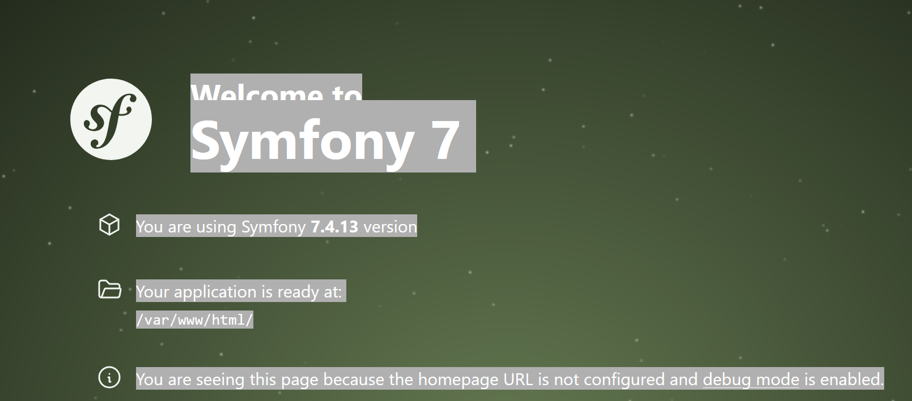
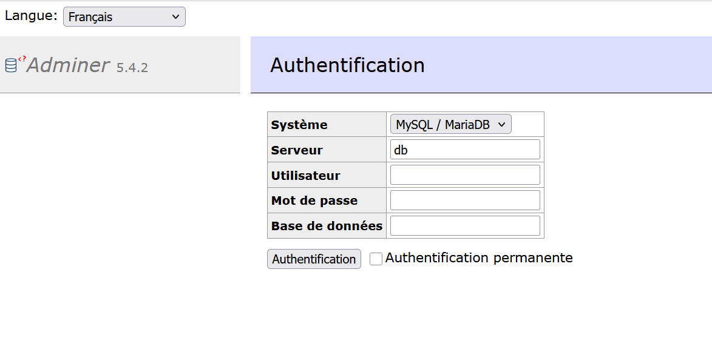
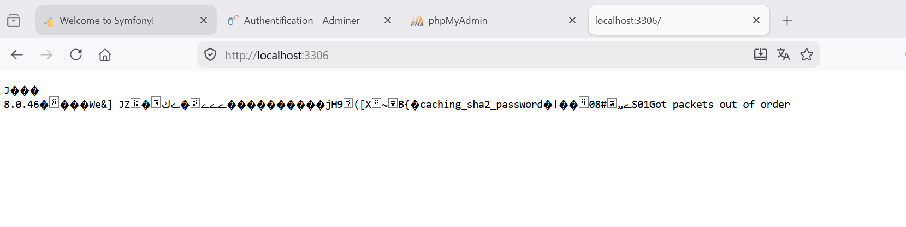

Le fichier docker-compose.yml : Explication de l'architecture du fichier
Ce fichier met en place l'infrastructure complète pour faire tourner une application web (ici orientée Symfony/PHP) de manière modulaire. L'environnement est divisé en plusieurs conteneurs isolés qui communiquent entre eux via un réseau virtuel défini à la fin (symfony_network).

1. Service app (Le moteur PHP)
Rôle : Il exécute le code PHP. Il utilise l'image php:8.2-fpm (FastCGI Process Manager), qui est optimisée pour dialoguer avec un serveur web comme Nginx.

Volumes : Ils permettent de relier des dossiers de la machine physique au conteneur. Ici, il monte le code source (./app), et isole les logs et le cache de Symfony pour qu'ils ne soient pas perdus si le conteneur redémarre.

2. Service webserver (Le serveur web Nginx)
Rôle : Il réceptionne les requêtes HTTP (quand tu tapes localhost:8080 dans le navigateur) et les transfère au service app si ce sont des fichiers PHP, ou sert directement les fichiers statiques (CSS, images).

Spécificité : Il expose le port 8080 sur la machine pour rediriger le trafic vers son port 80 interne. Il inclut une dépendance (depends_on: app), signifiant qu'il s'assure que le moteur PHP démarre avant lui.

3. Service database (Le serveur MySQL)
Rôle : C'est le gestionnaire de base de données (MySQL 8.0).

Environnement : Les variables créent automatiquement une base nommée symfony et un utilisateur dédié avec ses droits lors du premier lancement du conteneur.

Persistance : Le volume db_data est crucial. Sans lui, toutes tes données (tables, enregistrements) seraient supprimées à chaque fois qu'on coupe Docker.

4. Services adminer et phpmyadmin (Les interfaces de gestion BDD)
Rôle : Ce sont deux outils d'administration visuelle pour gérer la base de données 

Accès : Adminer est configuré sur le port 8081 et phpMyAdmin sur le port 8082.

Connexion : La variable PMA_HOST: symfony_db indique à phpMyAdmin de ne pas chercher la base de données en local, mais d'aller la lire sur le conteneur database via le réseau Docker partagé.

nginx/default.conf : root /var/www/html/public; : Pointe directement sur le dossier public de Symfony (là où se trouve le point d'entrée index.php).

fastcgi_pass app:9000; : Utilise le nom du service Docker app défini dans le docker-compose.yml pour lui transmettre les scripts PHP sur le port par défaut de PHP-FPM (9000).

try_files : Réécrit proprement les URL pour que toutes les requêtes qui ne correspondent pas à un fichier physique soient traitées par le routeur de Symfony.

Dockerfile : apt-get update : Met à jour la liste des logiciels disponibles.

curl : Permet de télécharger des fichiers depuis Internet (indispensable pour récupérer Composer).

unzip : Permet à Composer de décompresser rapidement les packages PHP téléchargés (les dépendances).

git : Permet à Composer de cloner des dépôts de code directement depuis GitHub ou GitLab.

-y : Valide automatiquement l'installation de ces outils sans bloquer le build en attendant une confirmation utilisateur.
curl -sS ... | php : Récupère le script d'installation officiel de Composer et l'exécute immédiatement avec PHP. Cela génère une archive exécutable nommée composer.phar.

&& : Assure que la seconde commande ne s'exécute que si le téléchargement s'est déroulé sans erreur.

mv composer.phar /usr/local/bin/composer : Déplace et renomme l'exécutable dans le dossier système /usr/local/bin/. Comme ce dossier est dans le PATH de Linux, tu pourras utiliser la commande globale composer de n'importe où dans le conteneur, au lieu de devoir taper php composer.phar.

En résumé : Ce fichier crée une image Docker "sur mesure" contenant PHP 8.2-FPM + Composer + Git, soit l'environnement minimal requis pour installer et faire tourner une application Symfony.

pour générer la clé secrète du .env : openssl rand -base64 128

 C:\laragon\www\unit_symfony> docker compose up -d --build
[+] up 48/48
 ✔ Image mysql:8.0                      Pulled                                                            39.3s
 ✔ Image php:8.2-fpm                    Pulled                                                            36.1s
 ✔ Image nginx:stable                   Pulled                                                            20.4s
 ✔ Network unit_symfony_symfony_network Created                                                            0.1s
 ✔ Volume unit_symfony_nginx_logs       Created                                                            0.0s
 ✔ Volume unit_symfony_db_data          Created                                                            0.0s
 ✔ Volume unit_symfony_phpmyadmin_data  Created                                                            0.0s
 ✔ Volume unit_symfony_app_logs         Created                                                            0.0s
 ✔ Volume unit_symfony_app_cache        Created                                                            0.0s
 ✔ Container symfony_app                Started                                                            1.9s
 ✔ Container symfony_db                 Started                                                            1.9s
 ✔ Container symfony_webserver          Started                                                            1.6s
 ... 2 more                                         

 C:\laragon\www\unit_symfony> docker exec -it symfony_app bash
root@ba1f273212e7:/var/www/html# 
root@ba1f273212e7:/var/www/html# chown -R www-data:www-data /var/www/html                     
root@ba1f273212e7:/var/www/html# chmod -R 775 /var/www/html/var
root@ba1f273212e7:/var/www/html# 

pour sortir : root@ba1f273212e7:/var/www/html# exit
exit

attention dans le Dockerfile : il faut changer FROM php:8.2-fpm en FROM php:8.3-fpm

## Captures d'écran

